

<picture>
  <source media="(prefers-color-scheme: dark)" srcset="./assets/apple/hero-dark.svg" />
  <source media="(prefers-color-scheme: light)" srcset="./assets/apple/hero-light.svg" />
  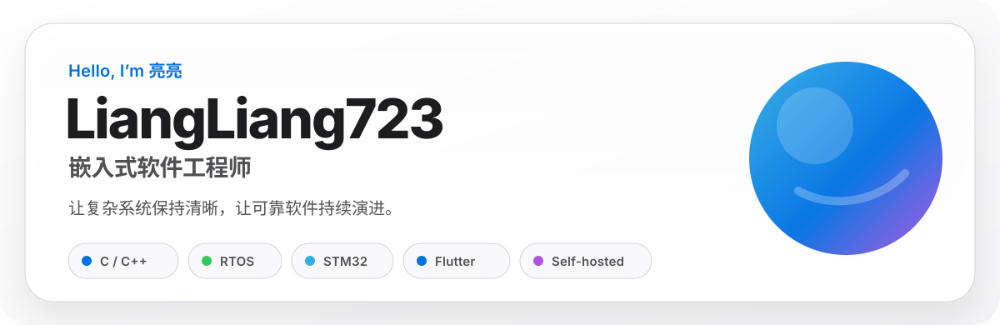
</picture>

## 关于我

<picture>
  <source media="(prefers-color-scheme: dark)" srcset="./assets/apple/profile-dark.svg" />
  <source media="(prefers-color-scheme: light)" srcset="./assets/apple/profile-light.svg" />
  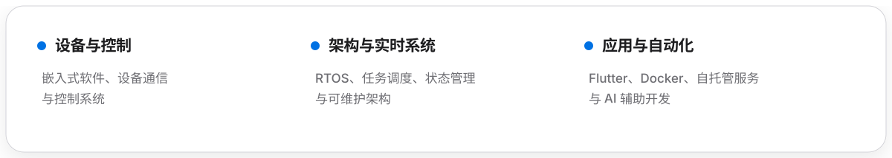
</picture>

## 技术能力

<picture>
  <source media="(prefers-color-scheme: dark)" srcset="./assets/apple/tech-stack-dark.svg" />
  <source media="(prefers-color-scheme: light)" srcset="./assets/apple/tech-stack-light.svg" />
  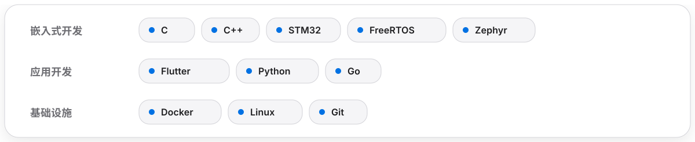
</picture>

## 精选项目

<table>
<tr>
<td width="50%" valign="top">
<a href="https://github.com/LiangLiang723/ai-berkshire">
<picture>
  <source media="(prefers-color-scheme: dark)" srcset="./assets/apple/project-ai-berkshire-dark.svg" />
  <source media="(prefers-color-scheme: light)" srcset="./assets/apple/project-ai-berkshire-light.svg" />
  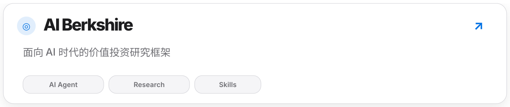
</picture>
</a>
</td>
<td width="50%" valign="top">
<a href="https://github.com/LiangLiang723/SuperCom">
<picture>
  <source media="(prefers-color-scheme: dark)" srcset="./assets/apple/project-supercom-dark.svg" />
  <source media="(prefers-color-scheme: light)" srcset="./assets/apple/project-supercom-light.svg" />
  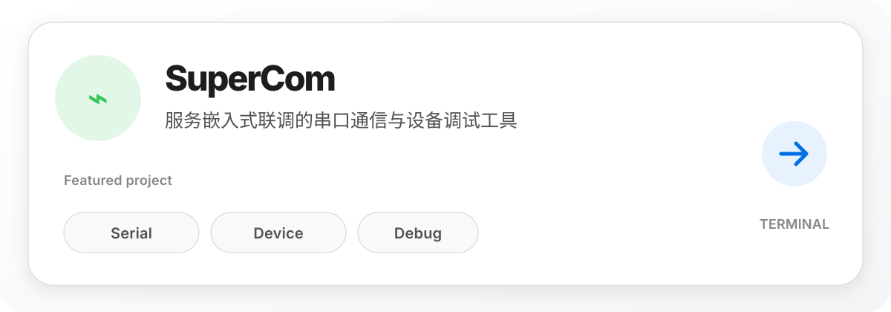
</picture>
</a>
</td>
</tr>
<tr>
<td width="50%" valign="top">
<a href="https://github.com/LiangLiang723/MultiTimer">
<picture>
  <source media="(prefers-color-scheme: dark)" srcset="./assets/apple/project-multitimer-dark.svg" />
  <source media="(prefers-color-scheme: light)" srcset="./assets/apple/project-multitimer-light.svg" />
  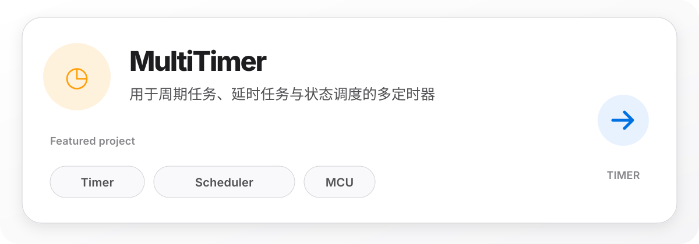
</picture>
</a>
</td>
<td width="50%" valign="top">
<a href="https://github.com/LiangLiang723/English-level-up-tips">
<picture>
  <source media="(prefers-color-scheme: dark)" srcset="./assets/apple/project-learning-dark.svg" />
  <source media="(prefers-color-scheme: light)" srcset="./assets/apple/project-learning-light.svg" />
  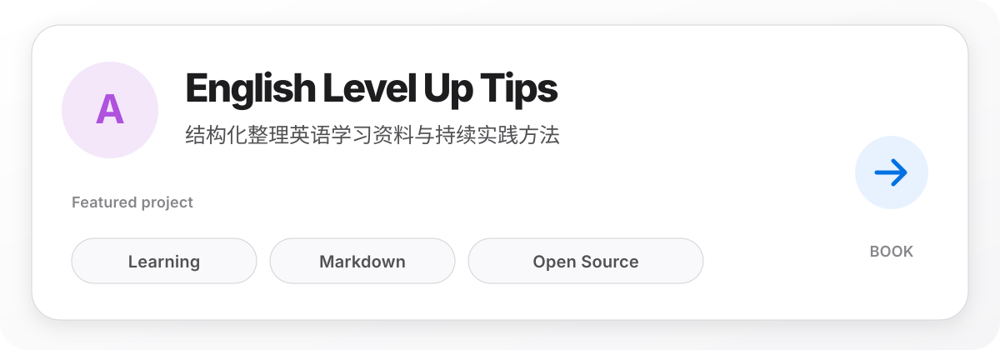
</picture>
</a>
</td>
</tr>
</table>

[查看全部仓库 →](https://github.com/LiangLiang723?tab=repositories)

## 开发数据

<picture>
  <source media="(prefers-color-scheme: dark)" srcset="./profile-summary-card-output/github_dark/0-profile-details.svg" />
  <source media="(prefers-color-scheme: light)" srcset="./profile-summary-card-output/github/0-profile-details.svg" />
  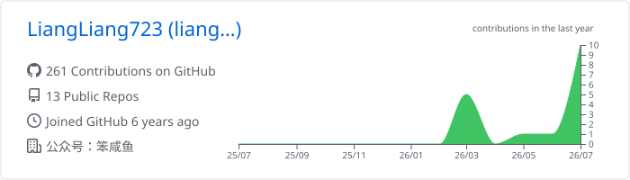
</picture>

<table>
<tr>
<td width="50%" valign="top">
<picture>
  <source media="(prefers-color-scheme: dark)" srcset="./profile-summary-card-output/github_dark/1-repos-per-language.svg" />
  <source media="(prefers-color-scheme: light)" srcset="./profile-summary-card-output/github/1-repos-per-language.svg" />
  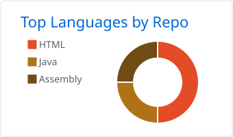
</picture>
</td>
<td width="50%" valign="top">
<picture>
  <source media="(prefers-color-scheme: dark)" srcset="./profile-summary-card-output/github_dark/3-stats.svg" />
  <source media="(prefers-color-scheme: light)" srcset="./profile-summary-card-output/github/3-stats.svg" />
  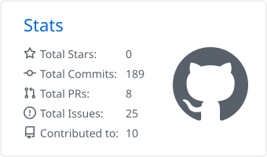
</picture>
</td>
</tr>
</table>

## 贡献轨迹

<picture>
  <source media="(prefers-color-scheme: dark)" srcset="https://raw.githubusercontent.com/LiangLiang723/LiangLiang723/output/github-contribution-grid-snake-dark.svg" />
  <source media="(prefers-color-scheme: light)" srcset="https://raw.githubusercontent.com/LiangLiang723/LiangLiang723/output/github-contribution-grid-snake.svg" />
  
</picture>

## 当前方向

<picture>
  <source media="(prefers-color-scheme: dark)" srcset="./assets/apple/focus-dark.svg" />
  <source media="(prefers-color-scheme: light)" srcset="./assets/apple/focus-light.svg" />
  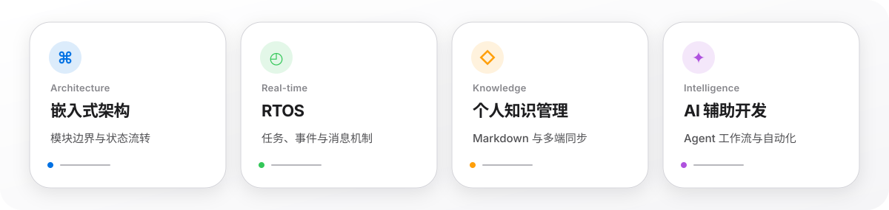
</picture>

<picture>
  <source media="(prefers-color-scheme: dark)" srcset="./assets/apple/footer-dark.svg" />
  <source media="(prefers-color-scheme: light)" srcset="./assets/apple/footer-light.svg" />
  
</picture>

