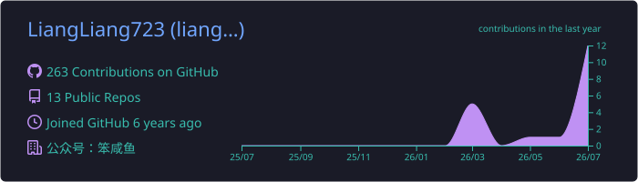
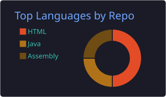
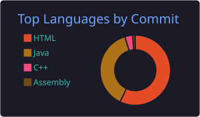
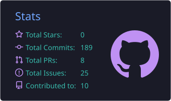
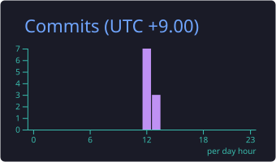

<div align="center">



<br />

<a href="https://github.com/LiangLiang723">
  
</a>
<a href="https://github.com/LiangLiang723?tab=followers">
  
</a>


</div>

---

## 👨‍💻 关于我

```text
亮亮 / LiangLiang723
├─ 💻 嵌入式软件工程师
├─ ⚙️ 专注 MCU（Microcontroller Unit，微控制器）、RTOS（Real-Time Operating System，实时操作系统）与设备通信
├─ 🧩 喜欢清晰、可维护、可测试的软件架构
├─ 📱 正在探索 Flutter（跨平台应用框架）个人记忆管理应用
├─ 🐳 热衷 Docker（容器平台）、Linux（开源操作系统）与自托管服务
└─ 🤖 使用 AI Agent（人工智能代理）提升开发、研究与自动化效率
```

> **让复杂系统保持清晰，让每一行代码都有明确边界。**

---

## 🧰 技术栈

<div align="center">

### 嵌入式与系统开发


### 应用、工具与基础设施


</div>

---

## 🚀 精选项目

<table>
<tr>
<td width="50%" valign="top">

### 📈 [AI Berkshire](https://github.com/LiangLiang723/ai-berkshire)

面向 AI（Artificial Intelligence，人工智能）时代的价值投资研究框架，将专业投研方法结构化为可复用的 Skill（技能包）与工作流。

`AI（人工智能）` `Codex（代码代理）` `研究框架` `自动化`

</td>
<td width="50%" valign="top">

### 🔌 [SuperCom](https://github.com/LiangLiang723/SuperCom)

围绕串口通信、设备调试和数据交互打造的实用工具项目，服务于嵌入式设备开发与联调。

`串口通信` `设备调试` `上位机` `嵌入式`

</td>
</tr>
<tr>
<td width="50%" valign="top">

### ⏱️ [MultiTimer](https://github.com/LiangLiang723/MultiTimer)

面向嵌入式场景的多定时器项目，用更清晰的方式组织周期任务、延时任务与状态调度。

`定时器` `任务调度` `C（编程语言）` `MCU（微控制器）`

</td>
<td width="50%" valign="top">

### 🧠 [English Level Up Tips](https://github.com/LiangLiang723/English-level-up-tips)

整理学习资料与实践方法，让知识积累更系统、更容易持续维护。

`知识管理` `学习记录` `Markdown（轻量标记语言）` `开源`

</td>
</tr>
</table>

<div align="center">

[查看全部仓库 →](https://github.com/LiangLiang723?tab=repositories)

</div>

---

## 📊 开发数据

<div align="center">



<br />




<br />




</div>

---

## 🐍 贡献轨迹

<div align="center">

<picture>
  <source media="(prefers-color-scheme: dark)" srcset="https://raw.githubusercontent.com/LiangLiang723/LiangLiang723/output/github-contribution-grid-snake-dark.svg" />
  <source media="(prefers-color-scheme: light)" srcset="https://raw.githubusercontent.com/LiangLiang723/LiangLiang723/output/github-contribution-grid-snake.svg" />
  
</picture>

</div>

---

## 🌌 我的开发理念

<div align="center">

| 架构 | 工程 | 成长 |
|:---:|:---:|:---:|
| 🧩 模块职责单一 | ✅ 代码可测试 | 📚 持续学习 |
| 🔌 接口边界清晰 | 🔍 问题可定位 | 🛠️ 持续实践 |
| 🔄 状态流转可控 | 📝 文档可维护 | 🚀 持续迭代 |

</div>

---

<details>
<summary><b>⚡ 当前关注方向</b></summary>

<br />

- 嵌入式软件架构与多状态并发处理
- RTOS（Real-Time Operating System，实时操作系统）任务、事件与消息机制
- Zephyr（实时操作系统）生态与设备服务化设计
- Flutter（跨平台应用框架）多端个人知识与记忆管理
- Docker（容器平台）自托管服务与自动化运维
- AI Agent（人工智能代理）辅助软件开发与投资研究

</details>

<br />

<div align="center">

### ✨ 保持好奇，持续构建


<sub>感谢访问我的 GitHub（代码托管平台）主页 · Thanks for visiting</sub>

</div>
