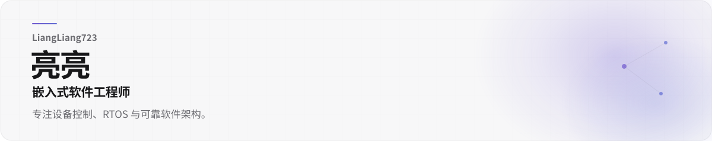

<picture>
  <source media="(prefers-color-scheme: dark)" srcset="./assets/linear/hero-dark.svg" />
  <source media="(prefers-color-scheme: light)" srcset="./assets/linear/hero-light.svg" />
  
</picture>

## 核心能力

**嵌入式开发**  
`C / C++ / STM32`  
设备通信、控制逻辑与嵌入式应用开发。

---

**实时系统**  
`RTOS（实时操作系统） / 状态管理 / 任务调度`  
关注并发、事件、消息与长期可维护性。

---

**工具与应用**  
`Flutter（跨平台应用框架） / Docker（容器平台） / AI Agent（人工智能代理）`  
构建个人工具、自托管服务与辅助开发工作流。

## 当前研究方向

|  | 方向 | 说明 |
|:--:|---|---|
| `●` | 嵌入式软件架构 | 模块边界、状态流转与可测试性 |
| `●` | RTOS（实时操作系统） | 任务、事件、消息与实时性 |
| `●` | 个人知识管理 | Markdown（轻量标记语言）、多端访问与长期沉淀 |
| `●` | AI Agent（人工智能代理）工作流 | 自动化开发、验证与维护 |

## 开发数据

<picture>
  <source media="(prefers-color-scheme: dark)" srcset="./assets/linear/stats-dark.svg" />
  <source media="(prefers-color-scheme: light)" srcset="./assets/linear/stats-light.svg" />
  
</picture>

## 贡献轨迹

<picture>
  <source media="(prefers-color-scheme: dark)" srcset="https://raw.githubusercontent.com/LiangLiang723/LiangLiang723/output/github-contribution-grid-snake-dark.svg" />
  <source media="(prefers-color-scheme: light)" srcset="https://raw.githubusercontent.com/LiangLiang723/LiangLiang723/output/github-contribution-grid-snake.svg" />
  
</picture>

